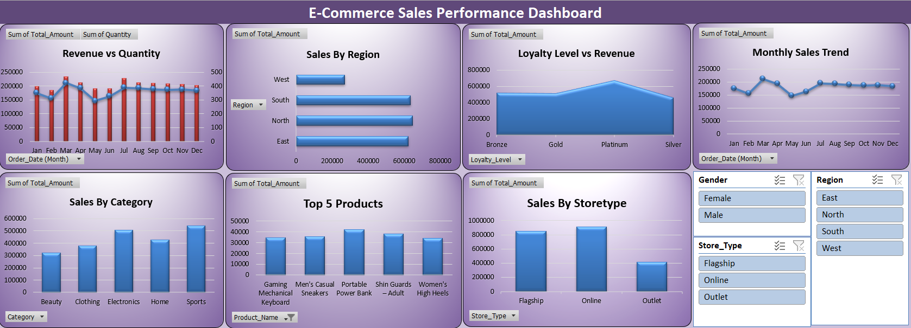

# E - Commerce Sales dataset

**Project Overview:**
This project focuses on analyzing an E-Commerce sales dataset to evaluate business performance and identify key sales trends.
The dataset was cleaned, structured, and transformed into a star schema model to support efficient analysis. Using Excel dashboards, the project visualizes revenue patterns, product performance, and regional sales distribution to support data-driven decision-making.

**Project Objectives:**
Analyze overall sales performance of the e-commerce business.
Identify top-performing products and categories.
Understand regional sales distribution.
Compare revenue and quantity trends.
Provide interactive filtering to explore business insights dynamically.

**Tools and Technologies Used:**
Microsoft Excel
Pivot Tables and Pivot Charts
Interactive Slicers
Dashboard Visualization Techniques

**Dashboard Features:**

**The interactive Excel dashboard includes the following visualizations:**

Revenue vs Quantity (Combo Chart)
Monthly Sales Trend (Line Chart)
Sales by Region
Sales by Category
Top 5 Products by Revenue
Sales by Store Type

**Interactive slicers allow filtering by:**
Region
Category
Store Type
Loyalty Level
Payment Type

**Key Insights:**

Certain regions contribute significantly more revenue compared to others.
A small number of top products generate a large share of total sales.
Product categories show varying performance levels across the dataset.
Sales trends fluctuate across months, indicating seasonal patterns.
Revenue and quantity trends provide insight into overall demand patterns.

**Dashboard Preview:**

